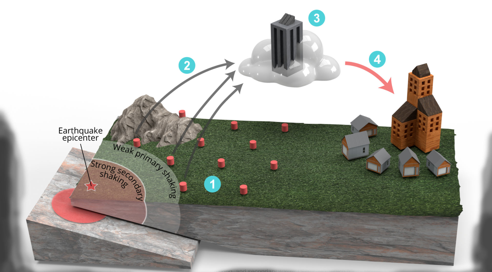
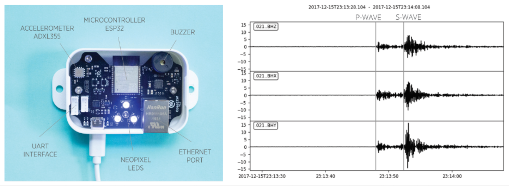
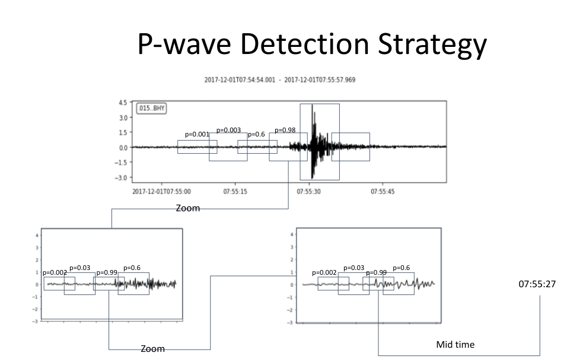

# Earthquake_Prediction_Challenge

[Instruction to retrieve Dataset](https://github.com/openeew/openeew/tree/master/data)

An earthquake early warning system (EEW) limits the impact of future earthquakes on communities living nearby. The system detects an earthquake at its very beginning and rapidly issues alerts to users in its path. The alert outpaces strong earthquake shaking and may provide critical time to take basic protective actions such as seeking cover or exiting a building. If you would like to know more about EEW systems, you can refer to [this paper](https://www.researchgate.net/publication/330744338_Earthquake_Early_Warning_Advances_Scientific_Challenges_and_Societal_Needs).



*Figure 1 | The principle and main components of earthquake early warning system.*

The backbone of an EEW system is a network of seismic instruments continuously recording the ground motion (no. 1 in Figure 1) and transmitting data (no. 2) to a remote server (no. 3). When an earthquake occurs, it produces two kinds of seismic waves; the primary waves (P-waves), which travel fast and produce low-intensity shaking, and secondary waves (S-waves), which travel slower, but produce higher-intensity shaking that often causes structural damage. The EEW system detects earthquake primary waves and issues an alert for a region that is expected to experience intense shaking (no. 4). As the wireless communication of the EEW system is faster than the speed of seismic waves in the geological environment, the alert may outpace the shaking.

### Seismic station and earthquake recordings

A seismic station is a device that records ground motion. In particular Grillo devices record the **acceleration** of the ground motion. The device uses a similar (albeit more precise) accelerometer sensor than you would find in consumer electronics such as smartphones. The device records the ground acceleration in three components - two horizontal ones and one vertical (x, y, z).



***Figure 2 |** Left: Description of Grillo the sensor. Right: A three-component recording of an earthquake arriving at a single seismic station.*

As mentioned above, once an earthquake occurs, it generates two kinds of waves that penetrate the Earth as body waves. Each wave has a characteristic speed and style of motion.

- **P-wave / Primary wave:** The primary wave the first seismic wave detected by seismographs due to high velocity in the rock environment between 5 and 8 km/s. The wave is usually relatively low-amplitude, does not carry much of the earthquake energy, and thus does not cause a significant damage.
- **S-wave / Secondary wave:** The secondary wave travels slower than the P-wave (3 to 5 km/s). However, it carries more energy and causes more damage than the P-wave.

EEW systems need to reliably detect the P-waves as this will allow for faster detections and therefore provide more time for the end users to take action. There is a number of traditional seismological algorithms that are usually based on rapid increase of [amplitude of ground motion](https://www.esgsolutions.com/technical-resources/microseismic-knowledgebase/event-detection-and-triggering). They are simple and effective, yet, they lack the ability to distinguish between signals created by earthquakes and other kind of disturbances (slamming doors, passing trucks..). In recent years, seismologists and data scientist have started to utilize neural-networks-based algorithms, hoping that those will be able to reduce the number of false positive detections.

## Model Architecture
### Overall Architecture


***Figure 3 |** P-wave Detection Strategy*

In detecting the P-wave, we follow these [methodology](https://www.sciencedirect.com/science/article/pii/S2405844021027080):

- Step1: Create rolling window from time series with length L and step-size T
- Step2: Normalize time domain, and concatenate discrete cosine transform (DCT) as the frequency domain 
- Step3: Calculate the probability of this window containing p-wave using DL model
- Step4: If the maximum probability across all window falls below a threshold, then return null
- Step5: Select highest probability window
- ... Repeat Step 1,2,3,5 for 3 times ...
- Return the average of the starting time and the end time of the highest probability window

### Backbone

The usage of the word followed [this paper](https://arxiv.org/pdf/1904.01169.pdf) [(further explanation)](https://stackoverflow.com/questions/59868132/what-does-backbone-mean-in-a-neural-network#:~:text=CNNs%20are%20used%20for%20extracting,and%20datasets%20such%20as%20ImageNet.). The "backbone" we chose to use are CNN based, each with different hyperparameter chosen via cross validation and grid search. The general form of these models follows:

- CONV2D
- Dropout
- CONV2D
- Dropout
- Flatten
- Dense
- Dropout
- Dense


## Before running main.py
This should be enough for the start. You will need more packages depending on the design of your solution.
```console
foo@bar:~$ pip install -r requirements.txt
foo
```
